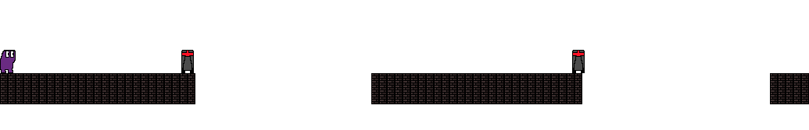

# gym-platform

OpenAI environment for training reinforcement learning algorithms possessing parametrized (hybrid) action spaces. The environment is a fork of the [cycraig gym-platform](https://github.com/cycraig/gym-platform) (archived and read-only), with the setup.py fixed. This enables the possibility to install it with pip without the need of the editable mode.

## Installation

```
pip install git+https://github.com/thomashirtz/gym-platform#egg=gym_platform
```


